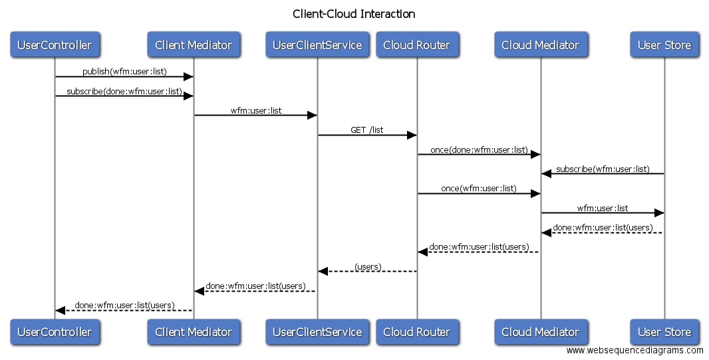

# Simple Raincatcher Example Module

This simple module is intended to demonstrate:

 - The structure of a Raincatcher module.
 - The concept of bridging client and cloud functionality in the same module.

These are key concepts when developing Raincatcher modules.

This module is a very simple Raincatcher module that allows the listing and creation of users. The goal of this module is to be integrated into a *client* and *cloud* app to allow client interactions (list user, create user) to be pushed to the cloud app.

This module is intended to be used with the [raincatcher-tutorial-cloud](https://github.com/feedhenry-raincatcher/raincatcher-tutorial-cloud) and [raincatcher-tutorial-client](https://github.com/feedhenry-raincatcher/raincatcher-tutorial-client) apps.

## Solution Overview

This module is separated into to sections: *client* and *cloud*. On both sides of the module, the mediator topic `wfm:user` is used for *publishing* and *subscribing* using the mediator.

### Client

As in all other Raincatcher modules, the client side of the module is based on AngularJS 1. This side of the module presents the user with a list of existing users and allows the user to create a new user.

This functionality is located in the `lib/angular` folder. A new `wfm.users` angular module is created with:

- A single directive (`lib/angular/user/user-directive.js`) for rendering existing users and the form for creating a new user.
- A single controller (`lib/angular/user/user-controller.js`) for updating the data bound in the directive. This controller publishes and subscribes to `wfm:user` topics to update its state.
- A single service (`lib/angular/services/user-client-service.js`) for making http requests to the cloud side of the app.

### Cloud

As in all other Raincatcher modules, the cloud side of the solution is based on ExpressJS routes. This side of the app is responsible for storing a set of users on the cloud.

The cloud side of the module is located in the `lib/server` folder.

The `lib/server/router.js` file creates an ExpressJS router and mounts the routes on the relevant endpoint configured by `lib/config-user`.

### Bridging Client and Cloud

The client and cloud side of this module are bridged by the `lib/angular/services/user-client-service` file. This service sets up subscribers for events that other parts of the client can publish.

To highlight this, consider an example flow:

1. When the `UserController` is initialised, it publishes the `wfm:user:list` topic. It also subscribes the to the `done` state for the `wfm:user:list` topic.
2. The `UserClientService` has subscribed to this topic, so the function is called.
3. The `UserClientService` makes a HTTP GET request to the server side of the module using the `list` function.
4. The GET handler in the `lib/server/router.js` receives the http request.
5. The GET handler subscribes once to the `done` state for the `wfm:user:list` topic.
6. The GET hanlder publishes the `wfm:user:list` topic. This is subscribed to by the `lib/server/userStore` User Store.
7. The User Store publishes the `done` state for the `wfm:user:list` topic. This is subscribed to in Step 5.
8. The GET handler responds with a HTTP response to the `UserClientService`.
9. The `UserClientService` handles the HTTP response and emits the `done` state for the `wfm:user:list` topic.
10. The `UserController` subscription in Step 1 is fired. This updates the state of the users on the `$scope`, which in turn updates the UI.

